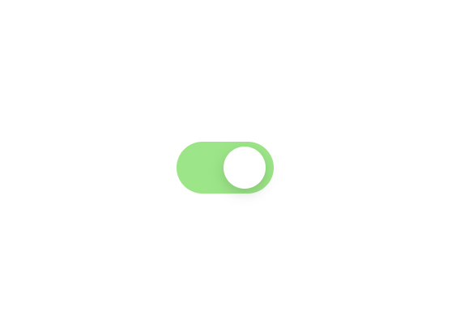
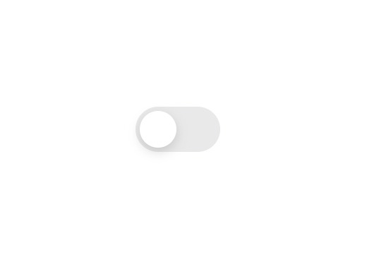
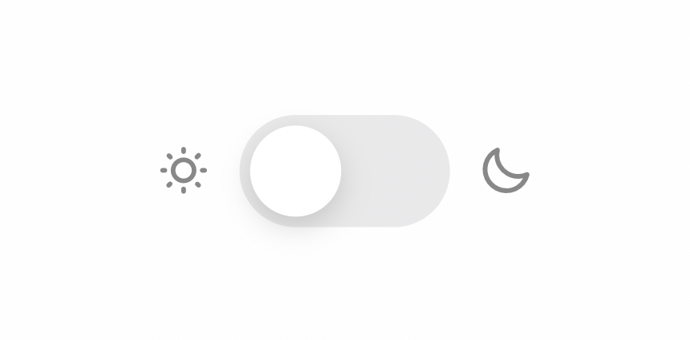
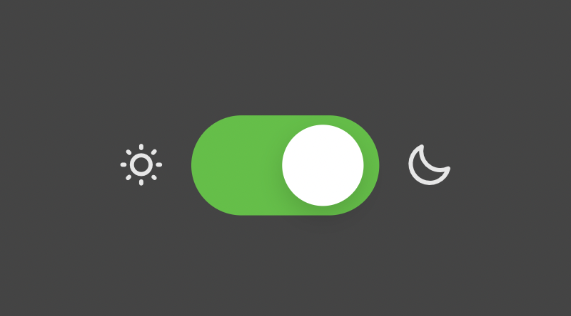

# Javascript And CSS Design Templates

In this github repository you will find several templates for your websites. You have buttons, navbars, animations in javascript (Switch Dark to light mode) and many others.

## Some templates :

<a href="https://github.com/PAPAMATHI/CSS-Design-Javascript-Templates/tree/main/button/IOS_Switch"><h2>IOS Switch button</h2></a>

    

 

---
 

<a href="https://github.com/PAPAMATHI/CSS-Design-Javascript-Templates/tree/main/theme/btn-change-theme-color"><h2>Switch Color Theme</h2></a>

    

